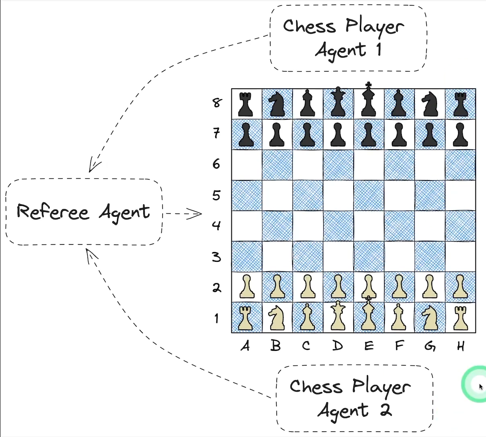

# 🤖♟️ LLM-ChessArena-Autogen

A conversational, multi-agent chess simulation where two LLM-powered agents play chess under the watchful eyes of a rule-enforcing **Referee Agent**.

Built using:
- 🧠 [AutoGen] (https://github.com/microsoft/autogen)
- ⚡️ Groq’s blazing-fast LLaMA3-70B
- ♟️ `python-chess` for board logic and UCI move legality
- 🖼️ SVG-based visualizations (auto-saved per move!)

---

## 🎮 Demo Architecture



> Two **ChessPlayerAgents** (white and black) communicate using Universal Chess Interface (UCI) format, make decisions based on board state, and throw in some friendly banter. The **RefereeAgent** validates all moves, maintains the official board state, and renders it.

---

## 🚀 Features

- ✅ Natural Language → UCI move conversion using LLMs
- 🧑‍⚖️ Referee Agent ensures rules are followed
- 🗣️ Chit-chat enabled chess agents with personality
- ♟️ Legal-move retry loop to avoid game-breaking errors
- 🖼️ Auto-save SVG chess board after each move
- 🌐 Browser visualization (outside notebooks)
- 📁 All game states saved in `/moves/`

---

## 📦 Installation

```bash
git clone https://github.com/Electrolight123/LLM-ChessArena-Autogen.git
cd LLM-ChessArena-Autogen

# (Recommended) Setup virtual environment
python -m venv venv
source venv/bin/activate  # On Windows: venv\Scripts\activate

pip install -r requirements.txt
```

---

## 🔑 Setup API Key

Create a `.env` file with your Groq API key:

```bash
echo 'GROQ_API_KEY="your_groq_key_here"' > .env
```

---

## ▶️ Run the Game

**Inside Jupyter Notebook or Script:**

```python
# chess.ipynb or agentchat-chess.py

# Launch players and begin the game!
player_black.initiate_chat(player_white, message="Your turn.")
```

Each move will:
- Be verified by the referee
- Visualize the updated board
- Save an SVG file like `moves/move_1.svg`, `move_2.svg`, etc.

---

## 📂 Project Structure

```
LLM-ChessArena-Autogen/
├── agentchat-chess.py           # Standalone agent game script
├── chess.ipynb                  # Jupyter Notebook version
├── .env                         # API key (excluded from Git)
├── requirements.txt             # Dependency list
├── assets/
│   └── chess-architecture.png   # System architecture diagram
└── moves/                       # Auto-generated SVGs for each move
```

---

## 🧠 How It Works

- **RefereeAgent**:
  - LLM instructed to output only legal UCI moves
  - Maintains and updates board state
  - Saves SVGs and handles errors

- **ChessPlayerAgent**:
  - Generates responses in UCI format with casual dialogue
  - Sends to Referee for validation
  - Retries on illegal moves

---

## 🧑‍💻 Author

Built by [Abhishek Bala] – feel free to connect or contribute!

---

## 📜 License

MIT License. See `LICENSE` for details.

---

> _"Sometimes the board is silent, but the minds are loud."_ – Now powered by LLMs.

